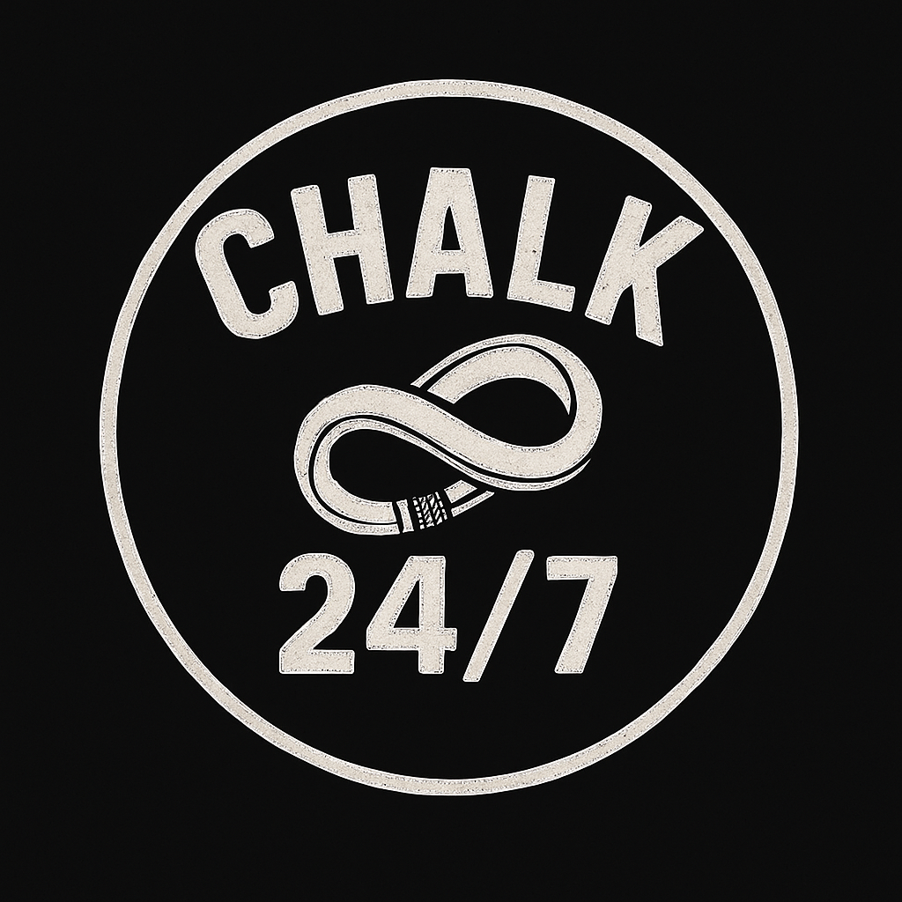

# Chalk 24/7 🧗‍♀️



**Live. Breathe. Climb.**

Welcome to Chalk 24/7 - A rock climbing community website for climbers who live and breathe the sport. This is more than just a brand; it's a community of passionate climbers who share the obsession for the next hold, the next route, the next summit.

🌐 **Live Site**: [chalk247.studio](https://chalk247.studio)

## 🎯 About

Chalk 24/7 is a rock climbing brand focused on bringing joy to the climbing community. We believe climbing isn't just a hobby—it's a lifestyle. Our platform connects climbers of all levels, from those working on their first V0 to those crushing V10s and beyond.

### Our Mission
- Foster a supportive, inclusive climbing community
- Share knowledge, routes, and climbing experiences
- Celebrate every send, from beginner to expert
- Promote sustainable climbing practices and respect for nature

## 🚀 Features

- **Community Blog**: Share climbing stories, tips, and experiences
- **Route Database**: Discover and share climbing routes (coming soon)
- **Events Calendar**: Find local climbing meetups and competitions
- **Resource Center**: Training tips, gear reviews, and technique guides
- **Responsive Design**: Optimized for all devices
- **Interactive Elements**: Chalk dust effects and smooth animations

## 🛠️ Built With

- **[Jekyll](https://jekyllrb.com/)** - Static site generator
- **[GitHub Pages](https://pages.github.com/)** - Hosting platform
- **SCSS** - Styling with variables and mixins
- **JavaScript** - Interactive features and animations
- **Liquid** - Templating language

## 📁 Project Structure

```
chalk247/
├── _config.yml          # Jekyll configuration
├── index.md             # Homepage content
├── about.md             # About page
├── CNAME               # Custom domain configuration
├── _layouts/           # Page templates
│   ├── default.html    # Base layout
│   ├── page.html       # Standard page layout
│   └── post.html       # Blog post layout
├── _includes/          # Reusable components
│   ├── header.html     # Site navigation
│   └── footer.html     # Site footer
├── _posts/             # Blog posts
├── _sass/              # SCSS partials
│   ├── _variables.scss # Design tokens
│   ├── _base.scss      # Base styles
│   └── _layout.scss    # Layout components
├── assets/             # Static assets
│   ├── css/           # Compiled styles
│   ├── images/        # Images and logo
│   └── js/            # JavaScript files
└── _data/             # Site data
    └── navigation.yml  # Navigation menu structure
```

## 🚦 Getting Started

### Prerequisites

- Ruby (version 2.5.0 or higher)
- RubyGems
- GCC and Make
- Jekyll

### Local Development

1. **Clone the repository**
   ```bash
   git clone https://github.com/YOUR_USERNAME/chalk247.git
   cd chalk247
   ```

2. **Install dependencies**
   ```bash
   bundle install
   ```

3. **Run the site locally**
   ```bash
   bundle exec jekyll serve
   ```

4. **View the site**
   Open your browser and navigate to `http://localhost:4000`

### Making Changes

1. Create a new branch for your feature
   ```bash
   git checkout -b feature/your-feature-name
   ```

2. Make your changes and test locally

3. Commit your changes
   ```bash
   git add .
   git commit -m "Add your descriptive commit message"
   ```

4. Push to GitHub
   ```bash
   git push origin feature/your-feature-name
   ```

## 📝 Adding Content

### Creating a Blog Post

1. Create a new file in `_posts/` with the format: `YYYY-MM-DD-post-title.md`

2. Add front matter:
   ```yaml
   ---
   layout: post
   title: "Your Post Title"
   date: YYYY-MM-DD
   categories: [climbing, community]
   tags: [bouldering, training]
   author: "Your Name"
   ---
   
   Your content here...
   ```

### Adding a New Page

1. Create a new `.md` file in the root directory

2. Add front matter:
   ```yaml
   ---
   layout: page
   title: "Page Title"
   permalink: /page-url/
   ---
   
   Your page content...
   ```

## 🎨 Customization

### Colors
Edit the color variables in `_sass/_variables.scss`:
- `$chalk-white`: Main light color
- `$rock-black`: Background color
- `$rope-orange`: Accent color
- `$granite-gray`: Secondary background

### Typography
Modify font settings in `_sass/_variables.scss`:
- `$base-font-family`: Main font stack
- `$base-font-size`: Base font size
- `$base-line-height`: Line height

### Navigation
Edit `_data/navigation.yml` to modify the main menu

## 🌐 Deployment

The site automatically deploys to GitHub Pages when changes are pushed to the `main` branch.

### Custom Domain Setup

1. The `CNAME` file contains: `chalk247.studio`

2. Configure DNS records with your domain provider:
   - A records pointing to GitHub's IPs
   - CNAME record for www subdomain

## 🤝 Contributing

We welcome contributions from the climbing community! Whether it's:
- Writing blog posts
- Sharing route information
- Improving the website design
- Fixing bugs
- Adding new features

Please feel free to submit issues and pull requests.

## 📄 License

This project is licensed under the MIT License - see the [LICENSE](LICENSE) file for details.

## 🧗 Community Guidelines

- **Respect the Rock**: Promote sustainable climbing practices
- **Safety First**: Share accurate, safety-conscious information
- **Inclusive Environment**: Welcome climbers of all backgrounds and abilities
- **Leave No Trace**: Advocate for environmental responsibility

## 📬 Contact

- **Website**: [chalk247.studio](https://chalk247.studio)
- **Email**: hello@chalk247.studio
- **Instagram**: [@chalk247](https://instagram.com/chalk247)
- **GitHub**: [@chalk247](https://github.com/chalk247)

## 🙏 Acknowledgments

- The global climbing community for inspiration
- All contributors who help make this project better
- Jekyll and GitHub Pages for making this possible

---

**Remember**: Leave no trace, respect the rock, climb responsibly. 🏔️

*Built by climbers, for climbers.*